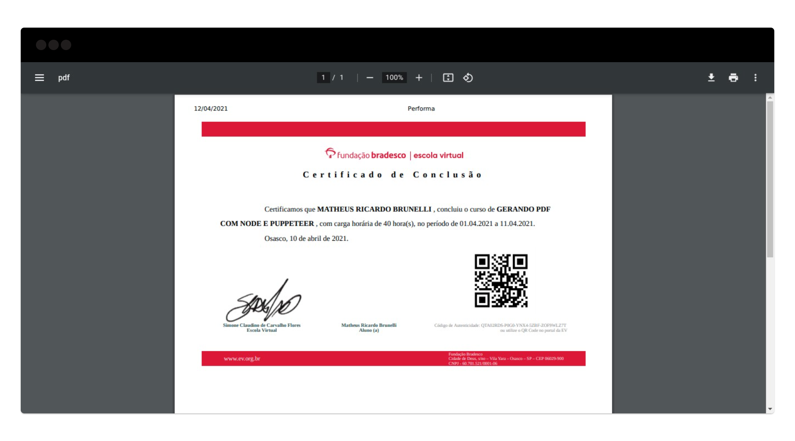

## Gerador de Certificado Fundação Bradesco
> Atenção: Essa aplicação foi criada com a finalidade de estudar mais sobre criação de PDFs com Node e Puppeteer, e não deve ser utilizada de forma indevida.

#### Como executar
Instale as dependências
```sh
npm install
```
Execute em modo produção
```sh
npm start
```

#### Screenshots
Formulário


PDF do Certificado
